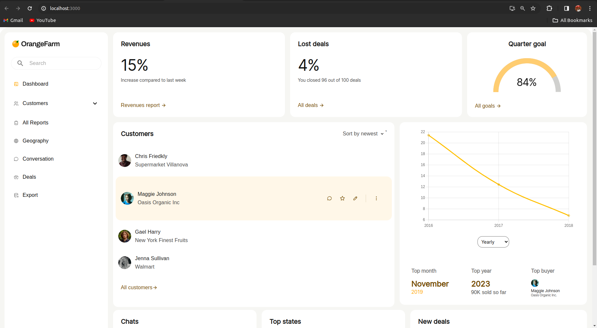
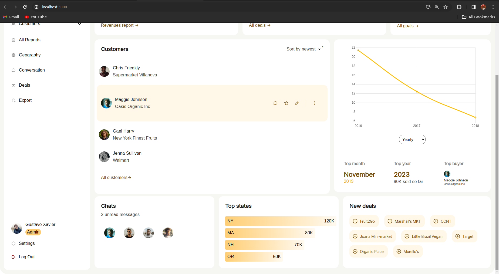
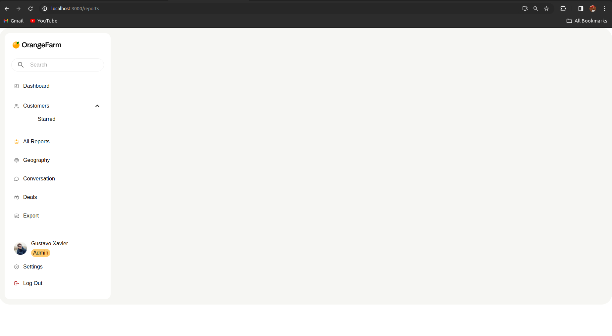

# React UI for Complex Web App

This is the frontend repository for the web app built with ReactJs and Material UI.

## Table of Contents
- [Overview](#overview)
- [Key Features](#key-features)
- [Installation](#installation)
- [Downsampling Algorithm](#downsampling-algorithm)
- [Deployment](#deployment)
- [Screenshots](#screenshots)

## Overview

This repository contains the frontend code for a complex web app built using ReactJs and Material UI. The primary objective of this project is to design a user-friendly UI based on the provided Figma design, ensuring adherence to layout, colors, fonts, and components. The entire UI is static, except for the interactive Growth Graph component. The frontend is designed to represent the relationship between profit percentage and time using a downsampling algorithm to handle a large dataset efficiently.

## Key Features

- ReactJs and Material UI for frontend development.
- UI design based on the provided Figma design.
- Interactive Growth Graph component representing the relationship between profit percentage and time.
- Downsampling algorithm implemented to handle large dataset efficiently.

## Installation

- Clone the repository.
- Navigate to the project directory.
- Run `npm install` to install dependencies.
- Run the development server using `npm start`.
- Access the web app on `http://localhost:3000` by default. 

## Downsampling Algorithm

The downsampling algorithm begins by reading financial data from a CSV file. It then condenses the dataset by calculating average profit percentages at hourly intervals. This preserves meaningful trends at an hourly resolution.

Subsequently, the algorithm aggregates data for different time resolutions. calculateYearlyAverage provides a high-level overview of trends for each year. calculateMonthlyAverage extracts monthly averages, offering insights into fluctuations within each month.

To capture trends at a quarterly level, calculateQuaterlyAverage categorizes data into quarters based on month indices. This provides additional insights into seasonal patterns and fluctuations.

In summary, the algorithm organizes and summarizes data at hourly, yearly, monthly, and quarterly intervals, facilitating efficient visualization and analysis in the financial analytics web app.

## Screenshots

